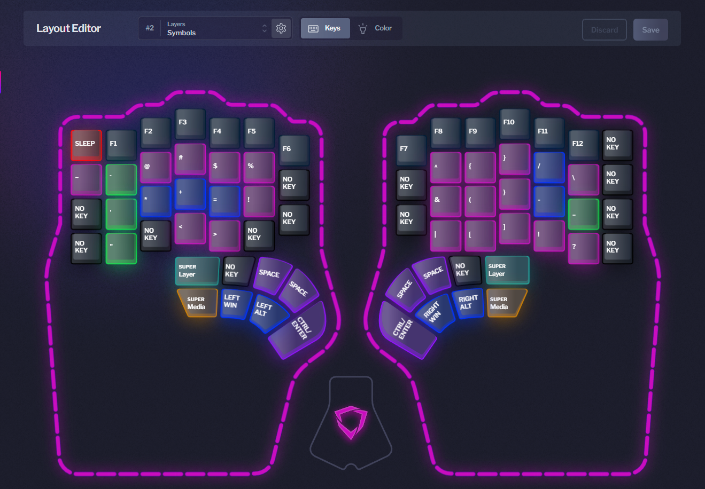
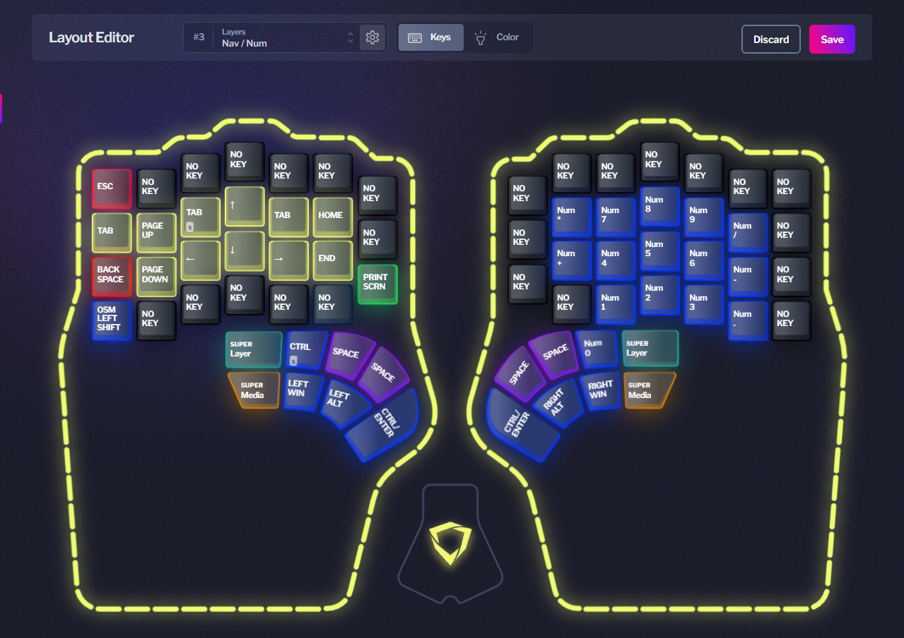

# Dygma Defy Profile and Settings

<!-- Table of Contents -->

<h2 id="table-of-contents" align="center"> 📖 Table of Contents</h2>

  
Table of Contents

  <a href="general"><strong> ➤ General </strong></a> 
  <a href="layers"><strong> ➤ Layers </strong></a>
  <ol>
    <li><a href="#layer-1"> Layer 1 - Base Layer </a></li>
    <li><a href="#layer-2"> Layer 2 - Symbols </a></li>
    <li><a href="#layer-3"> Layer 3 - Navigation / Numpad </a></li>
    <li><a href="#layer-4"> Layer 4 - Gaming </a></li>
  </ol>
  <a href="#macros"><strong> ➤ Macros </strong></a> 
  <a href="#superkeys"><strong> ➤ Superkeys </strong></a> 
  <a href="#preferences"><strong> ➤ Preferences </strong></a> 

<!-- General -->
<h2 id="general" align="center">
  📃 General
</h2>

  <ul>
    <li> This profile was created for the <b>Eng: US-QWERTY</b> keyboard format </li>
    <li> Layer creation was focused on keeping as much functionality in as few layers as possible </li>
    <ul>
      <li> These layers are all generally-useful. None are highly specialized for specific uses / programs (yet) </li>
    </ul>
    <li> For early learning, keys are colored based on their type: </li>
    <ul>
      <li> 🩷 ${\textsf{\color{magenta}Symbols}}$ </li>
      <li> ❤️ ${\textsf{\color{red}Deletions / Escapes}}$ </li>
      <li> 🧡 ${\textsf{\color{orange}Special Keys \& Gaming Placement}}$ </li>
      <li> 💛 ${\textsf{\color{yellow}Navigation}}$ </li>
      <li> 💚 ${\textsf{\color{green}PrtScr / Strings / Macros}}$ </li>
      <li> 🩵 ${\textsf{\color{cyan}Standard Keys / Nums}}$ </li>
      <li> 💙 ${\textsf{\color{blue}Modifiers}}$ </li>
      <li> 💜 ${\textsf{\color{purple}Space / Enter}}$ </li>
    </ul>
  </ul>

<!-- Layers -->
<h2 id="layers" align="center">
  </img>
  Layers
</h2>

  
<strong> Layer 1 - Base Layer </strong>

  </img>
  <a href="./layers/Base.json"> Click to Download Layer </a>
  <ul>
    <li> Keeps true to standard Eng: US-QWERTY layout for the most part </li>
    <li> Thumb cluster allows use of modifiers, Spacebar, and Enter </li>
    <li> Shift L2 allows quick access to Symbols </li>
    <li> OSL L3 allows me to quickly access by holding OR lock to my numpad as needed by double-tapping </li>
    <li> CapsLock -> Backspace </li>
    <li> Fast access to Home / End allow navigation to beginning / end of lines in code </li>
    <li> Backspace / Delete subject to change if they seem inconvenient </li>
    <li> <a href="#media-sk">Media Superkey</a> allows typical Play/Pause, Skip, Back -- as well as brightness adjustment </li>
  </ul>

  
<strong> Layer 2 - Symbols </strong>

  </img>
  <a href="./layers/Symbols.json"> Click to Download Layer </a>
  <ul>
    <li> Most commonly used symbols placed near dominant fingers (brackets for coding) </li>
    <li> Num keys -> Function keys </li>
    <li> $$x=\frac{y^2}{2}$$ </li>
    <li> Arithmetic symbols colored blue 💙 </li>
    <li> Thumb cluster mostly kept true to Base Layer except <a href="#layer-sk">Layer Superkey</a> which allows traveresal to L1, L3, or L4 as needed </li>
  </ul>

  
<strong> Layer 3 - Navigation / Numpad </strong>

  </img>
  <a href="./layers/Nav_Num.json">Click to Download Layer</a>
  <ul>
    <li> Use cases: data insertion, calculation, code / webpage navigation </li>
    <li> Arrow key and numpad placement don't require changing homerow positioning </li>
    <li> Add Ctrl + Shift to left thumb cluster for quick text selection </li>
  </ul>

  
<strong> Layer 4 - Gaming </strong>

  </img>
  <a href="./layers/Gaming.json">Click to Download Layer</a>
  <ul>
    <li> Top 2 Alphakey rows shifted 1 right </li>
    <ul>
      <li> Allows ergonomic WASD placement for most games </li>
      <li> 'I' & 'M' can be commonly used for Inventory / Map keybindings </li>
    </ul>
    <li> Numbers wrap on Left Half to allow more hotbar-selection in games that allow this </li>
    <li> 'G' & 'H' moved to thumb cluster to allow equipment selection without inhibiting movement (WASD) </li>
    <li> Ctrl -> Backspace & thumb cluster to allow movement variations (may change if it feels funny) </li>
    <li> Leaving this layer is exclusively on the Right Half <a href="#layer-sk">(Layer Superkey)</a> so it does not occur by accident </li>
    <li> Ctrl / Enter on thumb cluster may change to a macro that opens chat and switches to L1 for typing </li>
  </ul>

<!-- Macros -->
<h2 id="macros" align="center">
  </img>
  Macros
</h2>

➡️ PW is my base password macro, which I will not be sharing :)  
➡️ TODO: Macro to open chat and swap to L1 for L4?  

<!-- Superkeys -->
<h2 id="superkeys" align="center">
  </img>
  Superkeys
</h2>

➡️ PW uses PW macro on 2Tap & Hold to prevent accidental usage

  

    <strong> Media </strong>
    </img>
  

  | Action | Function|
  | :--- | :--- |
  | Tap | Play / Pause |
  | Hold | Back |
  | Tap & Hold | Defy Brightness + |
  | 2Tap | Skip |
  | 2Tap & Hold | Defy Brightness - |

  

    <strong> Layers </strong>
    </img>
  

  | Action | Function|
  | :--- | :--- |
  | Tap | Lock L1 |
  | Hold | Lock L2 |
  | Tap & Hold | Lock L4 |
  | 2Tap | Lock L4 |
  | 2Tap & Hold | No Key |

<!-- Preferences -->
<h2 id="preferences" align="center">
  </img>
  Preferences
</h2>

  

    <strong> LED </strong>
  

  | Setting | Preference |
  | :--- | :--- |
  | Timeout | 10m |
  | Backlight | 35 |
  | Underglow | 50 |

  

    <strong> Typing </strong>
  

  - These will still need to be fine-tuned
  
  | Setting | Preference |
  | :--- | :---: |
  | Dual-Function Overlap | 80 |
  | Dual-Function Hold Timeout | 70 |
  | Superkey Tap Timeout | 180 |
  | Superkey Hold Timeout | 140 |

  

    <strong> Mouse Keys </strong>
  

  - Default

